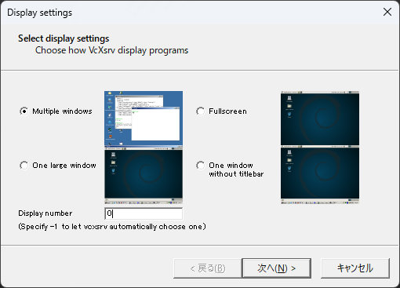

# PyHARK Docker Environment on Windows

This repository provides a Docker setup specifically tailored for running [PyHARK](https://hark.jp/packages/hark-acoustic-library-hark-lib/) on Windows systems.

## Environment Setup

To set up the Docker environment, execute the following commands:

```bash
sh build.sh
sh run.sh
```

## Configuring XLaunch for Windows Display

Before using the Docker environment, you need to configure XLaunch for display forwarding on Windows. Follow the settings shown in the screenshot below:



## Usage Instructions

After setting up the environment and configuring XLaunch, you can interact with it as follows:

1. Enter the Docker container:

    ```bash
    docker exec -it pyhark-docker fish
    ```

2. Navigate to the working directory:

    ```bash
    cd /mnt/practice3
    ```

3. Install the required Python packages:

    ```bash
    pip install -r requirements.txt
    ```

4. Run your PyHARK script with an input audio file:

    ```bash
    python practice3-1.py input.wav
    ```
